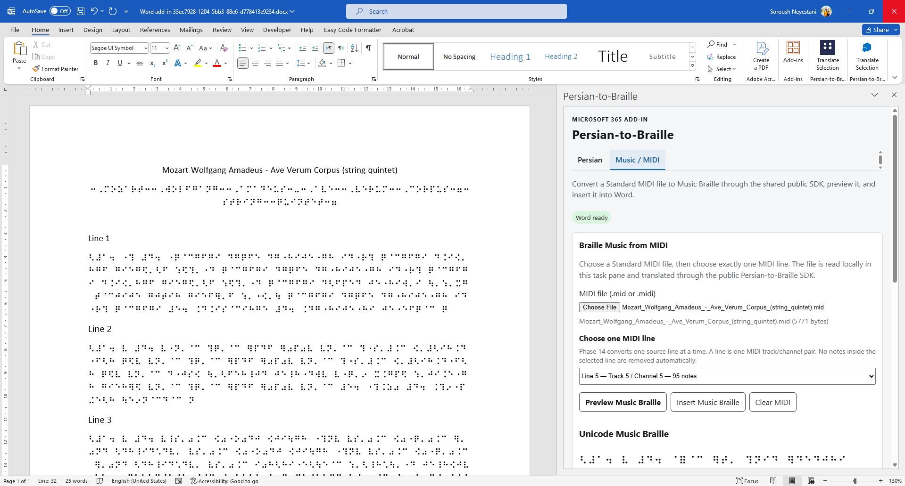

# Persian-to-Braille

**Persian-to-Braille** is an open-source Braille translation platform focused on Persian text, extensible Braille tooling, Microsoft 365 integration, and Braille Music.

The project originally started as a Persian Braille converter and has since been redesigned as a modular v2 platform with formal specifications, a reusable translation core, a public SDK, Microsoft Office integrations, reverse-translation foundations, and MIDI-to-Music-Braille support.

> **Current status:** v2 is under active development.
> Persian text translation and the Phase 14 Braille Music pipeline are implemented and tested. Microsoft 365 distribution is currently provided as a manual sideload preview; official Microsoft Marketplace publication is a separate release phase.

---

## Why this project exists

Persian Braille software has historically been fragmented across application-specific implementations, scripts, macros, and private conversion tables.

Persian-to-Braille v2 separates the problem into explicit layers:

* formal Braille specifications
* deterministic normalization
* reusable translation engines
* public SDK boundaries
* conformance and regression testing
* host integrations such as Microsoft Word, Excel, and PowerPoint
* Braille Music processing independent of text translation

The objective is not merely to provide a converter UI, but to build a reusable and auditable Braille platform that other applications can integrate with.

---

## Current capabilities

| Capability                            | Status                           | Notes                                                               |
| ------------------------------------- | -------------------------------- | ------------------------------------------------------------------- |
| Persian text → Unicode Braille        | ✅ Available                      | Based on the current `fa-ir-g1` profile                             |
| Persian normalization                 | ✅ Available                      | Deterministic normalization pipeline                                |
| Latin / English spans                 | ✅ Available                      | Uncontracted six-dot behavior supported by the current profile      |
| UEB Grade 2 English                   | ❌ Not claimed                    | Contracted UEB is outside the current text profile                  |
| Public SDK                            | ✅ Available in repository        | Stable application boundary over Core and Music                     |
| CLI / consumer tooling                | ✅ Implemented in v2 architecture | Uses the public SDK boundary                                        |
| Reverse Braille translation           | 🚧 Active development            | Reverse parser/API foundations exist; coverage continues separately |
| Microsoft Word text integration       | ✅ Supported                      | Selection-based translation                                         |
| Microsoft Excel text integration      | ✅ Supported                      | Cell-based translation                                              |
| Microsoft PowerPoint text integration | ✅ Supported                      | Selection-based translation                                         |
| Braille Music from MIDI               | ✅ Phase 14 complete              | Dedicated `@persian-braille/music` package                          |
| Music Braille in Word                 | ✅ Windows live-validated         | MIDI → source line → preview → insertion                            |
| Microsoft Marketplace publication     | ⏳ Planned separately             | Current public distribution is manual sideload preview              |
| MusicXML                              | ⏳ Planned                        | Reserved for Phase 19                                               |

---

## Architecture

Persian-to-Braille v2 is designed around strict dependency boundaries.

```text
                ┌─────────────────────┐
                │ Formal Braille Spec │
                └──────────┬──────────┘
                           │
                           ▼
                  ┌─────────────────┐
                  │      Core       │
                  │ Persian Braille │
                  └────────┬────────┘
                           │
                           │
          ┌────────────────┴────────────────┐
          │                                 │
          ▼                                 ▼
┌──────────────────┐              ┌──────────────────┐
│      Music       │              │ Reverse Engine   │
│ MIDI / Braille   │              │   Foundations    │
└────────┬─────────┘              └────────┬─────────┘
         │                                 │
         └────────────────┬────────────────┘
                          ▼
                 ┌─────────────────┐
                 │   Public SDK    │
                 └────────┬────────┘
                          │
          ┌───────────────┼─────────────────┐
          ▼               ▼                 ▼
        CLI / Web    Microsoft 365     Third-party
                    Word / Excel /      integrations
                     PowerPoint
```

Consumer applications must use the public SDK rather than depending directly on internal translation engines.

For Microsoft 365 the intended boundary is:

```text
Microsoft 365 → SDK → Core / Music
```

---

## Repository structure

```text
Persian-to-Braille/
├── packages/
│   ├── core/                Persian Braille translation engine
│   ├── music/               MIDI and Braille Music engine
│   └── sdk/                 Public developer-facing API
│
├── integrations/
│   └── microsoft365/        Word, Excel and PowerPoint integration
│
├── spec/                    Persian Braille specification
├── docs/                    Architecture, standards and validation records
├── scripts/                 Phase and regression validators
├── tools/                   Repository and specification tooling
└── legacy/
    └── v1/                  Archived original implementation
```

---

# Persian Braille

The text engine uses a formal Persian Braille profile rather than embedding translation behavior directly into UI code.

The pipeline separates:

```text
Input
  ↓
Unicode / Persian normalization
  ↓
Specification-driven rule selection
  ↓
Translation engine
  ↓
Unicode Braille
```

The current profile is identified as:

```text
fa-ir-g1
```

The specification contains character, context, layout, mode, normalization, and sequence rules.

Latin spans are supported by the existing profile as uncontracted six-dot text. This project does **not** currently claim full UEB Grade 2 / contracted English Braille compliance.

---

# Braille Music

Phase 14 introduces a dedicated Braille Music subsystem.

The implementation is intentionally separated from Persian text translation:

```text
MIDI
  ↓
SMF parser
  ↓
Track / Channel source classification
  ↓
Source-line selection
  ↓
Rhythm and notation normalization
  ↓
Music Braille encoder
  ↓
Unicode Music Braille / BRF
```

The Music implementation lives in:

```text
packages/music/
```

and is exposed to applications through the public SDK.

## MIDI workflow

The current production-integrated workflow is:

```text
.mid / .midi
      ↓
Parse MIDI
      ↓
Discover source lines
      ↓
Track + Channel
      ↓
Select exactly one source line
      ↓
Generate Music Braille
      ↓
Unicode / BRF Preview
      ↓
Insert into Microsoft Word
```

A source line is identified by **Track + Channel**.

The application intentionally does not guess which line represents melody, accompaniment, percussion, pad, or another musical role.

It also does not silently delete notes from the selected source line.

Unsupported source material fails closed instead of being silently rewritten.

---

## Microsoft Word — Braille Music

Braille Music is currently integrated with **Microsoft Word Desktop on Windows**.

The task pane exposes two main feature surfaces:

```text
Persian / English
Music / MIDI
```

The Music workflow supports:

* MIDI file selection
* Track + Channel source-line discovery
* exactly-one-line selection
* Unicode Music Braille preview
* BRF preview
* preview invalidation when the selected source changes
* insertion of the exact preview into Word
* insertion at the current caret position

The Windows implementation has also been live-tested using real-world multi-track MIDI material.



---

# Microsoft 365

The Microsoft 365 integration is implemented as a consumer of the public SDK.

### Word

```text
Selected text
   ↓
SDK translation
   ↓
Preview
   ↓
Copy / Replace / Insert
```

Word also hosts the Braille Music workflow.

### Excel

Excel provides Persian / English text translation for supported cell selections.

The integration preserves the SDK boundary and does not implement independent translation semantics inside the Office host.

### PowerPoint

PowerPoint provides Persian / English translation for selected text and similarly delegates translation to the public SDK.

---

# Public preview installation

A public manual-sideload preview of the Microsoft 365 integration is available at:

**https://soroushneyestani.github.io/Persian-to-Braille/install.html**

The preview installation is intended for testing and evaluation.

It is **not** currently presented as an official Microsoft Marketplace publication.

---

# Development

## Requirements

The v2 repository uses:

* Node.js
* pnpm
* TypeScript
* Git

Clone the repository:

```bash
git clone https://github.com/soroushneyestani/Persian-to-Braille.git
cd Persian-to-Braille
```

Install workspace dependencies:

```bash
pnpm install
```

Build the main packages:

```bash
pnpm --filter @persian-braille/core run build
pnpm --filter @persian-braille/music run build
pnpm --filter @persian-braille/sdk run build
```

Build the Microsoft 365 integration:

```bash
pnpm --dir integrations/microsoft365 run build
```

---

# Testing

The repository uses executable validators and regression suites rather than relying only on manual verification.

Examples:

```bash
pnpm --filter @persian-braille/core run test
pnpm --filter @persian-braille/music run test
pnpm --filter @persian-braille/sdk run test
pnpm --dir integrations/microsoft365 run test
```

Phase-specific validators are also stored in:

```text
scripts/
tools/architecture/
```

The repository includes validation for specification integrity, package boundaries, translation behavior, public SDK contracts, Microsoft 365 host behavior, Music Braille behavior, and distribution artifacts.

---

# Braille Music specification and evidence

Braille Music specification artifacts are stored under:

```text
packages/music/spec/
docs/music-braille/
docs/architecture/
```

Phase 14 contains explicit contracts and validation evidence for areas including:

* MIDI parsing
* source-line identity
* notation quantization
* Unicode Music Braille encoding
* stateful encoding
* in-accord representation
* meter changes
* rhythm coherence
* real-world MIDI hardening
* Word insertion
* Windows live acceptance
* public preview distribution

Real-world MIDI files used during testing are **not committed** to the repository.

---

# Design principles

Persian-to-Braille v2 follows several architectural rules:

**Specification before implementation**
Translation behavior should be derived from explicit specifications and contracts.

**SDK boundary first**
Applications should consume the public SDK rather than internal engines.

**Fail closed**
Unsupported or ambiguous input should not be silently approximated when doing so could change Braille semantics.

**Deterministic behavior**
Equivalent input and configuration should produce reproducible results.

**Auditable evolution**
Significant translation behavior is accompanied by contracts, validators, tests, or architectural evidence.

**Host independence**
The translation engine must remain reusable outside Microsoft Office.

---

# Roadmap

The project is being developed incrementally.

Major v2 areas include:

```text
Persian Braille specification
        ↓
Repository architecture
        ↓
Unicode normalization
        ↓
Persian Braille Core
        ↓
Conformance suite
        ↓
Public SDK
        ↓
CLI / Web consumers
        ↓
Microsoft Word integration
        ↓
Microsoft 365 integration
        ↓
Developer ecosystem
        ↓
Reverse translation
        ↓
Braille Music
        ↓
Multi-language / General Braille Framework
        ↓
Office on the Web
        ↓
Office for Mac
        ↓
Official Marketplace publication
        ↓
MusicXML
```

### Current major milestone

**Phase 14 — Braille Music: complete**

Future work includes broader multi-language architecture, additional Microsoft Office environments, official Marketplace publication, and MusicXML support.

---

# Legacy version

The original Persian-to-Braille implementation dates back to the first generation of the project and is preserved for historical and compatibility analysis.

Legacy code is kept under:

```text
legacy/v1/
```

The v2 implementation is a clean architectural redesign rather than a direct continuation of the legacy application structure.

---

# فارسی

**Persian-to-Braille** در نسخهٔ جدید فقط یک مبدل سادهٔ متن فارسی به بریل نیست.

نسخهٔ v2 به‌صورت یک پلتفرم ماژولار طراحی شده و شامل موتور مستقل بریل فارسی، specification رسمی، SDK عمومی، ابزارهای validation، یکپارچه‌سازی با Microsoft 365، زیرساخت ترجمهٔ معکوس و موتور Braille Music است.

در Phase 14 امکان تبدیل فایل‌های MIDI به Music Braille نیز اضافه شده است. در Microsoft Word کاربر می‌تواند فایل MIDI را انتخاب کند، Line موردنظر را بر اساس Track و Channel مشخص کند، خروجی Unicode/BRF را مشاهده کند و همان خروجی را مستقیماً در Word درج کند.

هدف بلندمدت پروژه این است که هستهٔ Braille وابسته به Microsoft Office نباشد و نرم‌افزارها و توسعه‌دهندگان دیگر نیز بتوانند از طریق SDK از آن استفاده کنند.

---

# Contributing

Issues and pull requests are welcome.

Changes affecting translation semantics should include appropriate tests and, where applicable, specification or contract updates.

Please avoid introducing application-specific translation rules into consumer layers when the behavior belongs in Core, Music, or the formal specification.

---

# License

Persian-to-Braille v2 is released under the **MIT License**.

See [LICENSE](LICENSE) for details.

---

**Repository:**
https://github.com/soroushneyestani/Persian-to-Braille